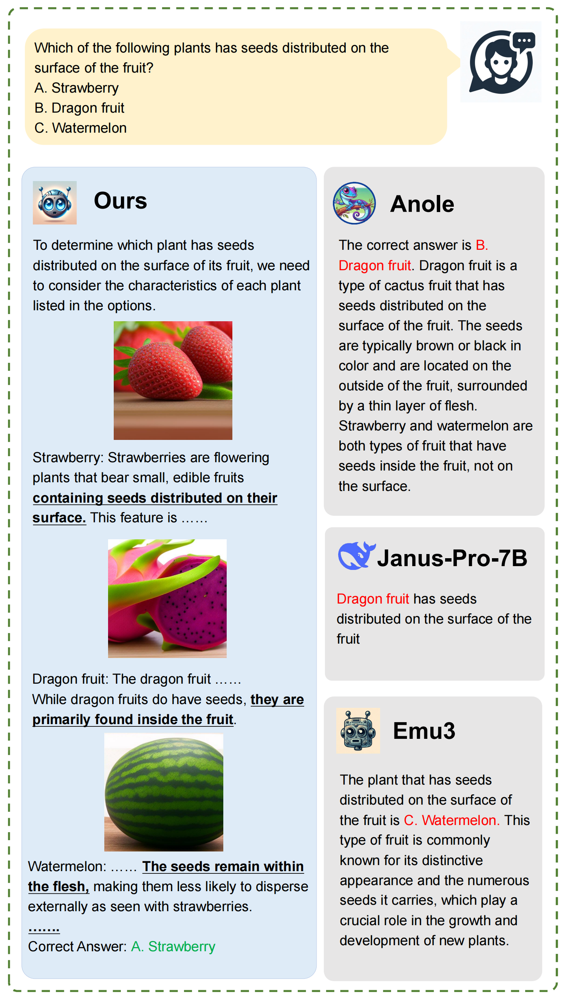
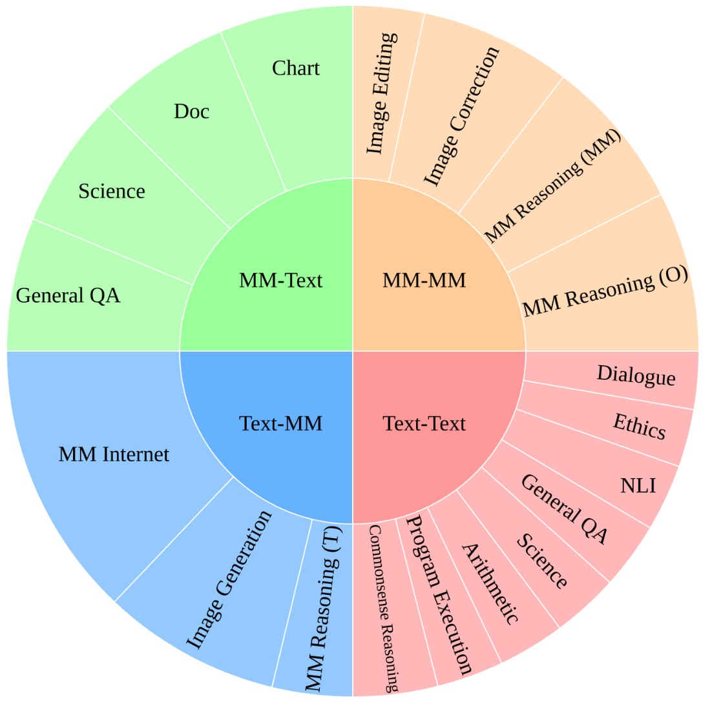
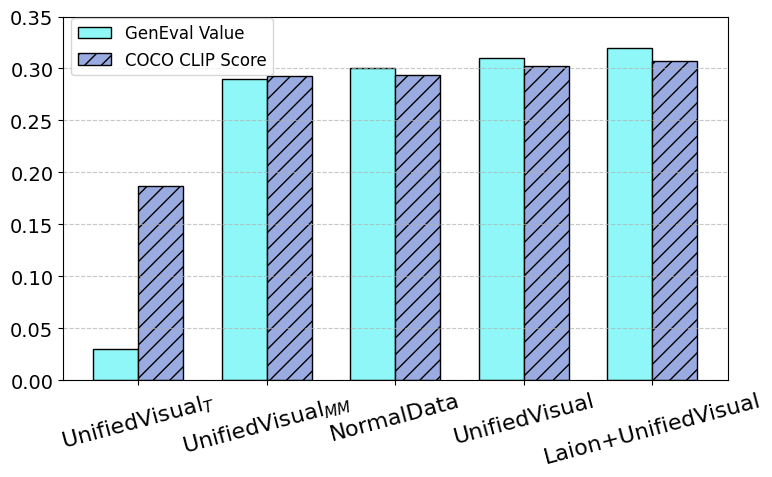
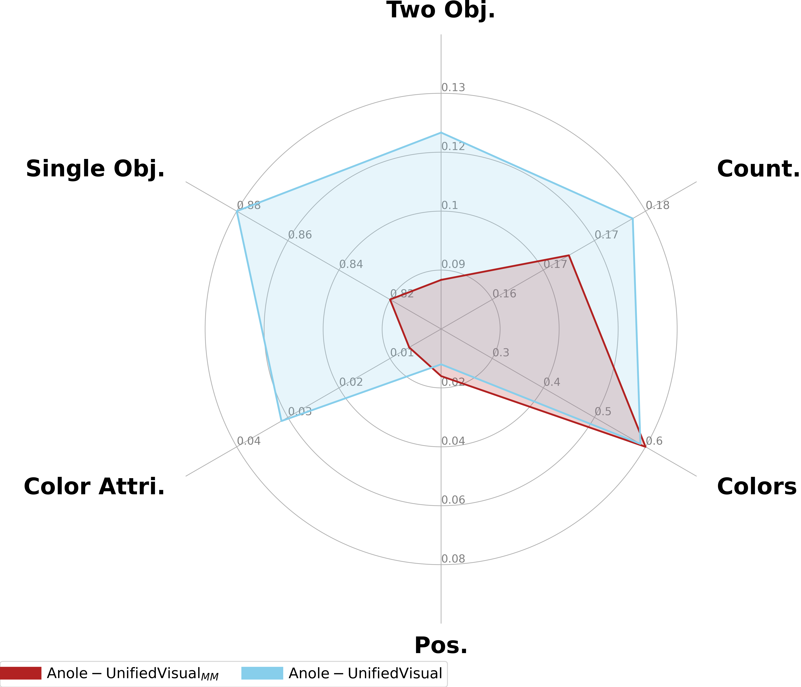
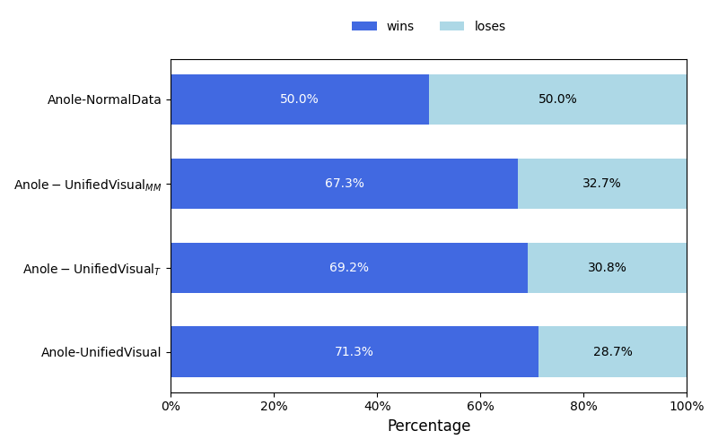

# UnifiedVisual: A Framework for Constructing Unified Vision-Language Datasets

[](https://arxiv.org/abs/2509.14738)
[](https://huggingface.co/datasets/fnlp-vision/UnifiedVisual-240K)




## TL;DR
UnifiedVisual is a framework and a 240K-sample unified vision-language dataset that explicitly couples multimodal understanding and generation, enabling mutual reinforcement between the two. Models trained on UnifiedVisual-240K achieve strong performance across diverse benchmarks and show better synergy between reasoning and image synthesis.

---

## Highlights
- Synergistic framework: Integrates understanding and generation with multimodal reasoning chains so each capability strengthens the other.
- UnifiedVisual-240K: 240K high-quality samples combining 120K multimodal generation and 120K understanding data.
- Broad task coverage: Visual generation, multimodal reasoning (image/text/multimodal inputs), and curated multimodal internet data.
- Strong results: Consistent gains in multimodal understanding, generation (MS-COCO, GenEval), and text reasoning (AlpacaEval).
- Extensible: Data construction recipes are scalable to larger datasets.

## Abstract (short)
Unified vision large language models have advanced rapidly, yet progress is constrained by datasets that isolate understanding from generation. We introduce UnifiedVisual, a dataset construction framework, and present UnifiedVisual-240K. It integrates diverse visual/text inputs and outputs, embedding reasoning within generation and generation within reasoning. Experiments show models trained on UnifiedVisual-240K consistently perform strongly across tasks and exhibit clear mutual enhancement between understanding and generation.

---

## UnifiedVisual-240K at a glance
- Total size: 240K
  - 120K Understanding samples (60K LLaVA-CoT, 60K CoT-Collection)
  - ~120K Generation samples constructed via our framework
- Generation subset breakdown (from the paper):
  - MM Internet: 29,399
  - Image Editing: 9,024
  - Image Generation: 22,755
  - Image Correction: 20,000
  - MM Reasoning (O): 21,000
  - MM Reasoning (T): 7,276
  - MM Reasoning (MM): 17,761



---

## Method overview
UnifiedVisual builds a unified dataset that stimulates synergy between understanding and generation through three pillars:

1) Visual Generation
- Image Generation: Two routes to elevate complexity beyond direct caption→image mapping:
  - Topic- and Scene-Based Generation: Implicit captions → rationale (GPT-4) → image (DALL·E-3)
  - Category- and Image-Based Generation: Real images + categories → implicit instructions → rationale (GPT-4) → aligned outputs
- Image Editing: Rewrite simple edit prompts into nuanced instructions; generate rationales (GPT-4o) to clarify objectives.
- Image Correction: Detect and fix inconsistencies between image and description; synthesize counterfactuals and rationales (Stable Diffusion, GPT-4o).

2) Multimodal Reasoning
- MM Reasoning (O): Rationale references details from the original input image.
- MM Reasoning (MM): Joint reasoning over image + text inputs; retrieve style-consistent images using keywords and CLIP filtering.
- MM Reasoning (T): Text-only questions that require generated images to aid reasoning; synthesize images from textual descriptions.

3) Multimodal Internet Data
- Curate interleaved text-image data from the web with multi-perspective filtering using strong VLLMs for coherence and answerability.

---

## Results (selected)
- Multimodal understanding: UnifiedVisual training outperforms baselines across RealWorldQA, MMVP, ScienceQA, VStar, MME, and POPE.
- Multimodal generation: Competitive or superior performance on MS-COCO CLIP score and GenEval overall; detailed gains on object count/color/attributes.
- Text reasoning: Higher win rates on AlpacaEval relative to NormalData training.

<p>


</p>

<p>

</p>

---


## Citation
Please cite the paper if you use UnifiedVisual:

```bibtex
@misc{wang2025unifiedvisualframeworkconstructingunified,
      title={UnifiedVisual: A Framework for Constructing Unified Vision-Language Datasets}, 
      author={Pengyu Wang and Shaojun Zhou and Chenkun Tan and Xinghao Wang and Wei Huang and Zhen Ye and Zhaowei Li and Botian Jiang and Dong Zhang and Xipeng Qiu},
      year={2025},
      eprint={2509.14738},
      archivePrefix={arXiv},
      primaryClass={cs.CL},
      url={https://arxiv.org/abs/2509.14738}, 
}
```

